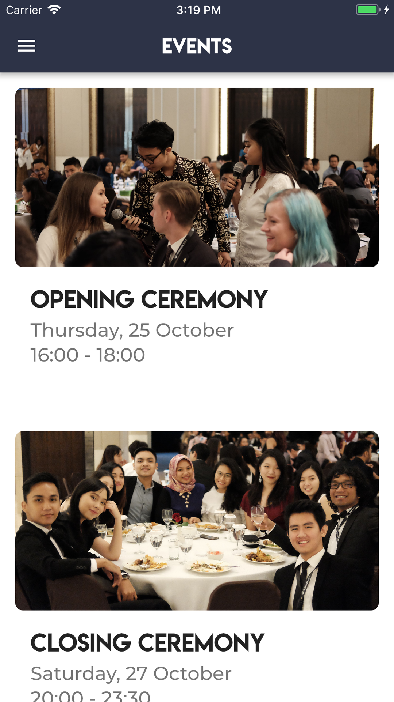

#  JOINMUN 2018 Flutter App


The Jogja International Model United Nations ([JOINMUN](https://www.joinmun.com)) 2018 official app.


This is the application for delegates and guests of Jogja International Model United Nations 2018. Your experience throughout the conference will be a lot more convenient with this app as your guide as you go through the 4-day event and explore Yogyakarta.

This app is built using [Flutter](https://flutter.io/) and [Firebase](https://firebase.google.com) for both Android and iOS.

# Features
   


- View all the schedules and events of JOINMUN 2018
- View amazing places to visit in Yogyakarta
- View supporting documents for JOINMUN 2018
- and many more..

# Getting started
1. Install Flutter. See https://flutter.io/setup/
2. Setting up the IntelliJ. See https://flutter.io/ide-setup/
3. Fork and clone this repository.
4. Move to `joinmun` directory.
5. Run `flutter run` command.


# Contributing
This project may be used as a reference for upcoming JOINMUN events.

Any form of contribution is always welcomed! Feel free to report Issue or send Pull Request!

```
