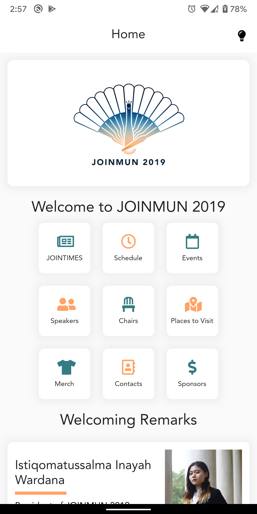
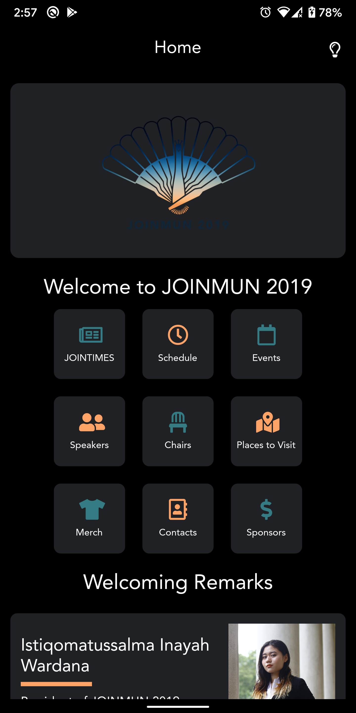
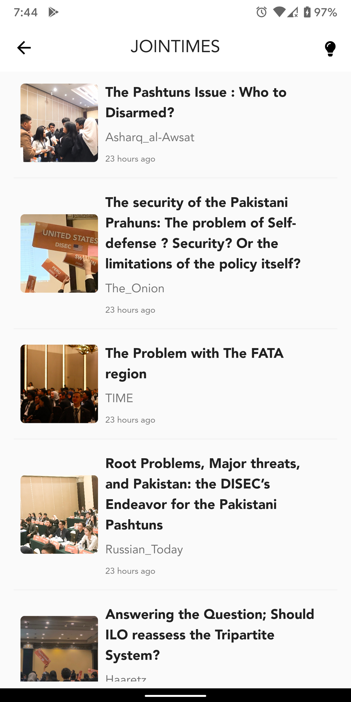
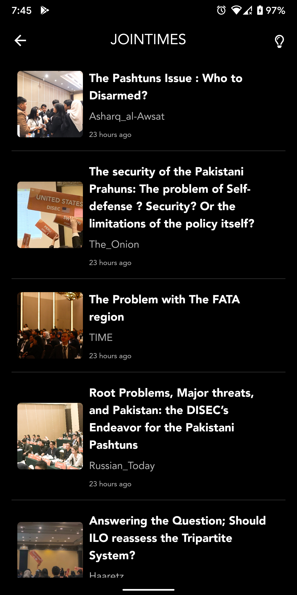
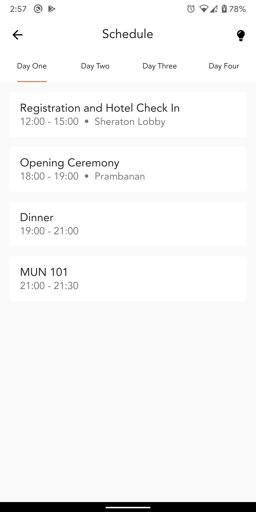
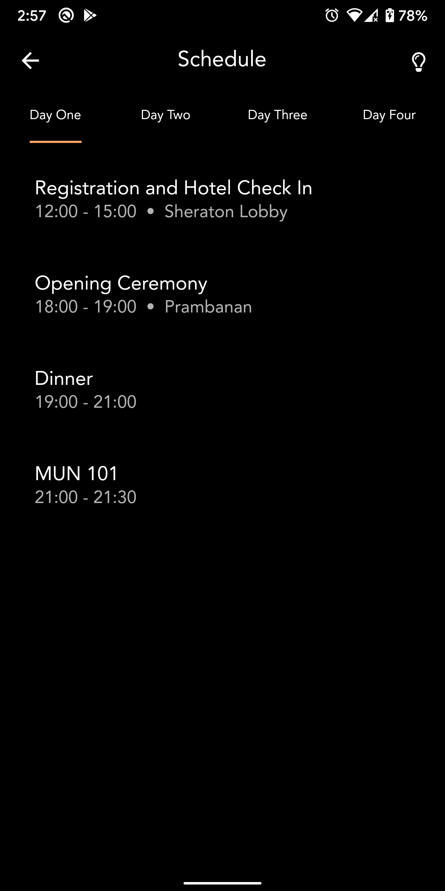
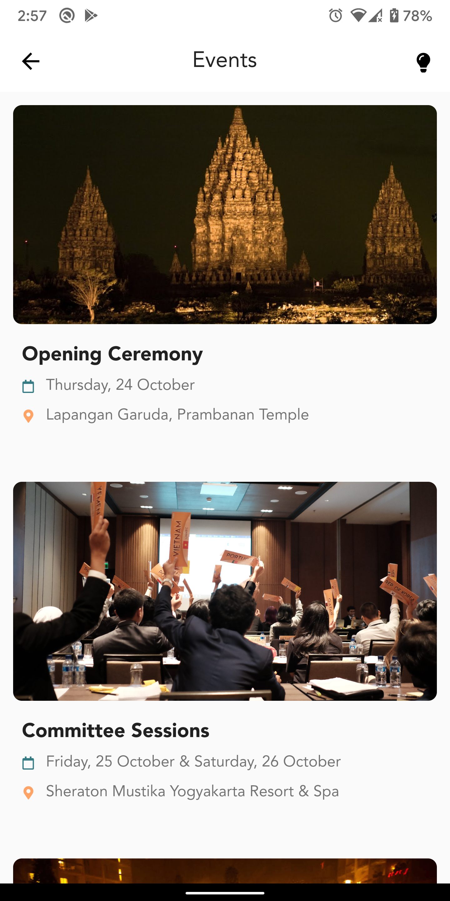
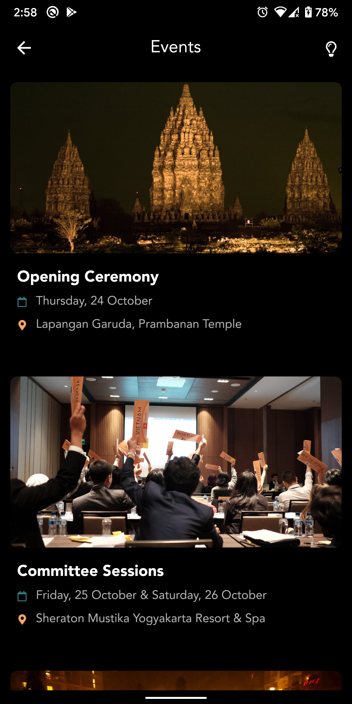

#  JOINMUN 2019 Flutter App

The Jogja International Model United Nations ([JOINMUN](https://www.jogjainternationalmun.com)) 2019 official app.

This is the application for delegates and guests of Jogja International Model United Nations 2019. Your experience throughout the conference will be a lot more convenient with this app as your guide as you go through the 4-day event and explore Yogyakarta.

This app is built using [Flutter](https://flutter.io/) and [Firebase Cloud Firestore](https://firebase.google.com) for both Android and iOS.

You can install the app via  or  

# Features
   

- View all the schedules and events of JOINMUN 2019
- View amazing places to visit in Yogyakarta
- Get reminders of upcoming events
- Contact the delegates directly
- and many more..

# Getting started
1. Install Flutter. See https://flutter.io/setup/
2. Setting up the IntelliJ. See https://flutter.io/ide-setup/
3. Fork and clone this repository.
4. Move to `joinmun` directory.
5. Run `flutter run` command.

# Credits
This project is possible thanks to [iampawan's GDG Devfest App](https://github.com/iampawan/GDG-DevFest-App/) where it provides the general look of the app and also the Bloc architecture which I can then implement and expand upon on this project.

